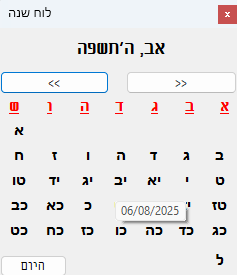

### הוראות התקנה
להורדת התוכנה היכנסו לדף "[Releases](https://github.com/ShlomoV5/HebCalTray/releases)" והורידו את הקובץ "HebTray.exe".
מומלץ להעתיק את הקובץ אל שולחן העבודה כדי שיהיה נגיש (סליחה, כרגע עוד אין התקנה ועדכוני גירסה).
### שימוש בתוכנה

#
התוכנה נפתחת בסמל בשורת המשימות למטה.
**בהצבעה** על הסמל תוכלו לראות את התאריך.
**לחיצה ימנית** עם העכבר פותחת את התפריט להצגת הלוח/יציאה.
**כדי לבחור חודש** ניתן ללחוץ על החיצים או להקיש על שם החודש- ייפתח חלון לבחירת חודש ושנה.

### תכונות שהייתי רוצה להוסיף בעתיד ואולי אתם תוסיפו?
* התוכנה מדגישה כרגע מועדים בלבד. הייתי רוצה להוסיף את פרשת השבוע. (מעדיף לא להשתמש בHebCal לא בגלל שאני נגד אלא פשוט כי אני רוצה שהתוכנה תעבוד ללא תלות בAPI באינטרנט. במידה ותוכלו לעזור להטמיע את HebCal מקומית אשמח!
* זמני היום בהלכה (כאמור עם HebCal או בנפרד)
* שמירת אירועים אישיים וכד'
התוכנה פותחה בעקבות כך שWindows 11 לא תומך בתוכנה הנפלאה Taskbar Luach (שכבר לא ניתנת להורדה) מאת Ulrich Greve (tichnut.de)


---

# HebTray – Hebrew Calendar Tray App 🇮🇱🗓


A lightweight Windows tray application that shows the **current Hebrew date**, and allows viewing a **monthly Hebrew calendar** by clicking the tray icon.

This project uses .NET WinForms and the built-in HebrewCalendar API, with zero internet requirement after installation.

---

## ✅ Features

- 🕎 Shows Hebrew date in system tray (tooltip shows full date)
- 📅 Pop-up Hebrew calendar with navigation
- 🖱️ Right-click menu: Show Calendar / Exit

---

## 📦 Download & Run

👉 [Download the latest version from the Releases tab](https://github.com/ShlomoV5/HebCalTray/releases)

### 🧠 Instructions (English)

1. Click the link above and download the latest `.exe` file from **Releases**.
2. Place the file on your **Desktop** for easy access.
3. **Double-click** the file – the app will start and appear as an icon near your clock (system tray).
4. **Right-click** the tray icon to show the calendar or exit.

📝 No installation required. Runs quietly in the background.

---


## 🛠 Developers

This project is written in **VB.NET (WinForms)**. To build locally:

```bash
git clone https://github.com/ShlomoV5/HebCalTray.git
```
Then open HebTray.sln in Visual Studio and build using the Release configuration.

GitHub Actions automatically builds and uploads .exe artifacts for every pull request and creates a downloadable release on merge to main.
